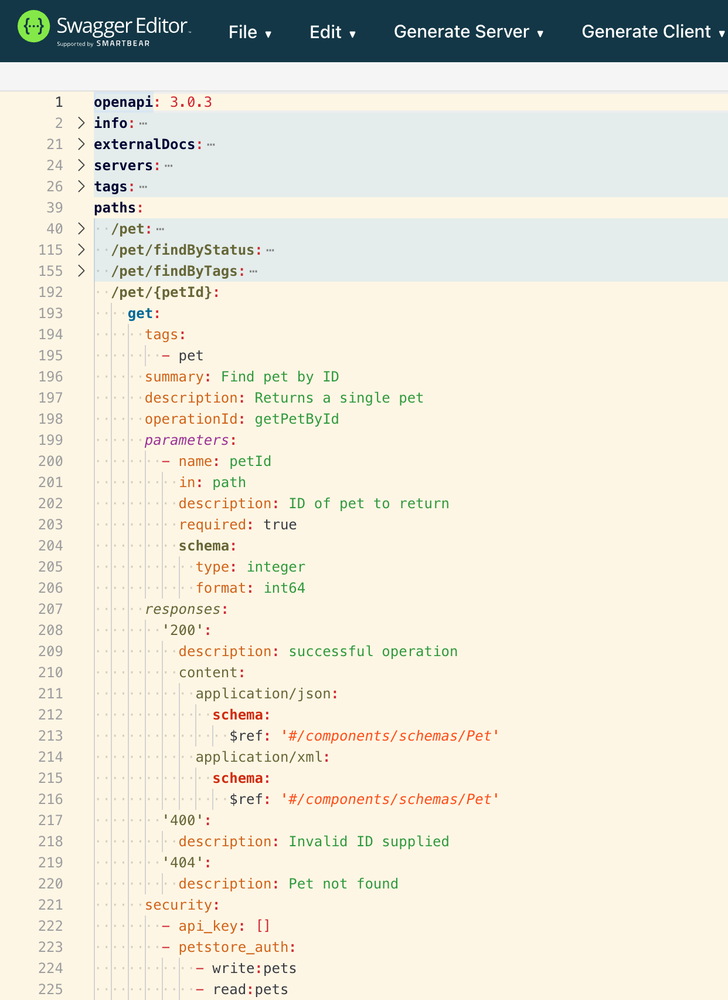
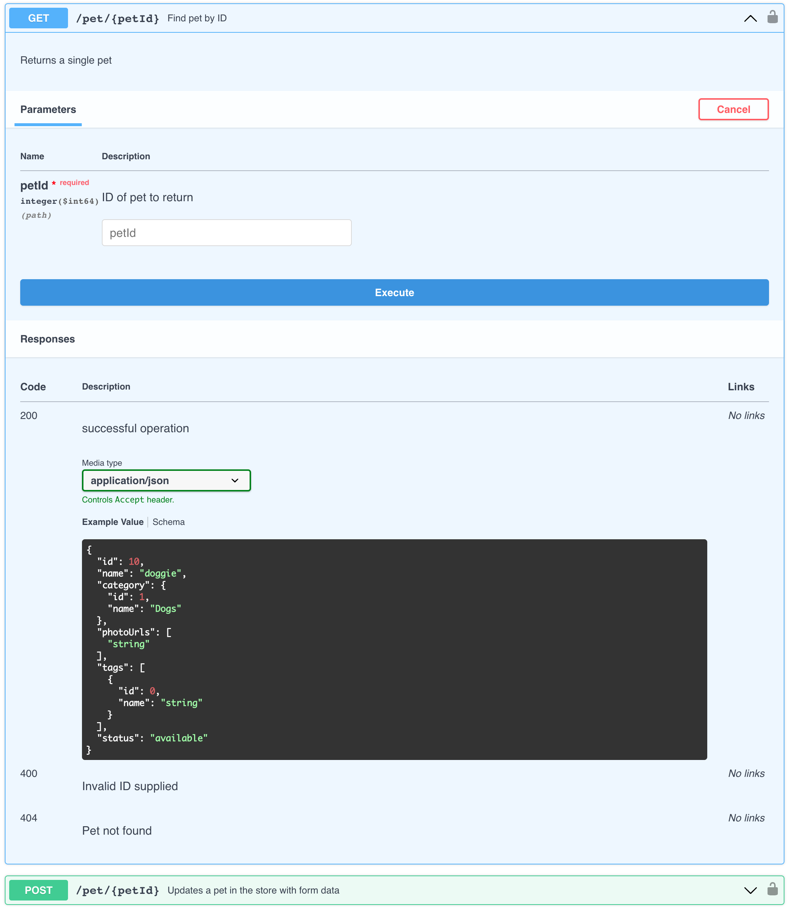

# OpenAPI

## What is OpenAPI

- OpenAPI specifies a way of describing HTTP-basedAPIs, which are typically RESTful APIs.
- OpenAPI can also include information such as where the API is hosted, what authorization is required to access it...
- An OpenAPI definition comes in the form of a YAML or JSON file that describes the inputs and outputs of an API.
- Lots of tools available like linter, spec editors, spec renderer, spec analyzer, mock server/client code generator...
- Historically started as Swagger which was adopted by SmartBear in 2015, which then donated the spec part to Linux Foundation
- OpenAPI Specification (OAS) is maintained by the OpenAPI initiative (OAI): https://www.openapis.org/

## What are the tools available

- Swagger Editor : browser based editor where you can write OpenAPI specs, https://editor-next.swagger.io/
- Swagger UI : render OpenAPI specs as interactive API documentation.
- Swagger Codegen : generates server stubs and client libraries from an OpenAPI specs.

## Example of OpenAPI YAML file

## Example of OpenAPI Swagger UI rendering

